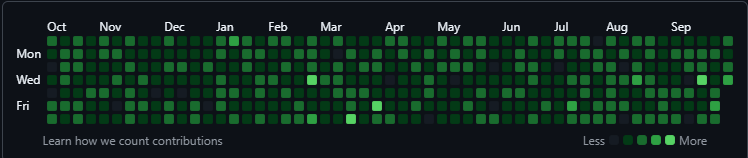

# GoCommit
**GoCommit** is a Node.js tool that automatically generates Git commits over a chosen date range. It can create commit activity without manually creating each commit.


## Features
The project is currently in development

- [x] Customizable starting date
- [x] Custom number of commits
- [x] Automatic Git commit generation
- [x] Works with any Git repository
- [ ] Gui 
## Getting Started
1. **Requirements**

&emsp;&emsp;• [Node.js](https://nodejs.org/)<br>
&emsp;&emsp;• [npm](https://docs.npmjs.com/downloading-and-installing-node-js-and-npm)<br>
&emsp;&emsp;• [Git](https://git-scm.com/install/)<br>
&emsp;&emsp;• A Git repository where you want to GoCommit generate commits _(a fork of GoCommit or an existing/new repository)_


2. **Clone this repository**
```bash
git clone https://github.com/Liamoulee/GoCommit.git
cd GoCommit
```
3. **Set up the project**

&emsp;&emsp;Initialize a new Node.js project:
```bash
npm init -y
```
4. **Install the required npm modules**

&emsp;&emsp;You'll need a few modules to get everything running smoothly. Install them all with:
```bash
npm install jsonfile moment simple-git random
```
5. **Configure GoCommit**

&emsp;&emsp;**Starting date**

&emsp;&emsp;Change the `startDate` variable in `index.js`

&emsp;&emsp;**Example:**

&emsp;&emsp;I don't want to commit before `1999/01/01`, so:
```js
const startDate = moment("1999-01-01");
```
&emsp;&emsp;**Number of commits**

&emsp;&emsp;Change the value passed to `makeCommits()` in `index.js`

&emsp;&emsp;**Example:**

&emsp;&emsp;I only want to do 100 commits, so:
```js
makeCommits(100);
```
6. **Run GoCommit**
```bash
node index.js
```